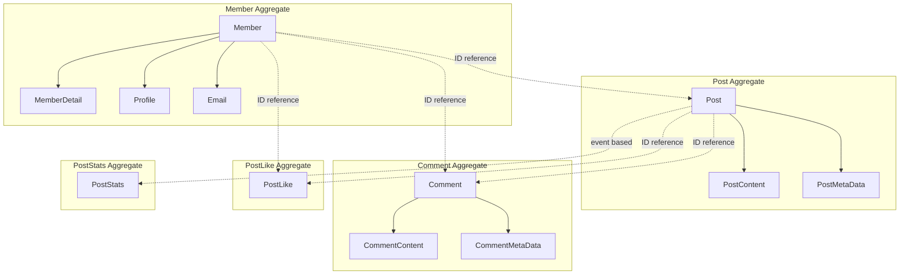
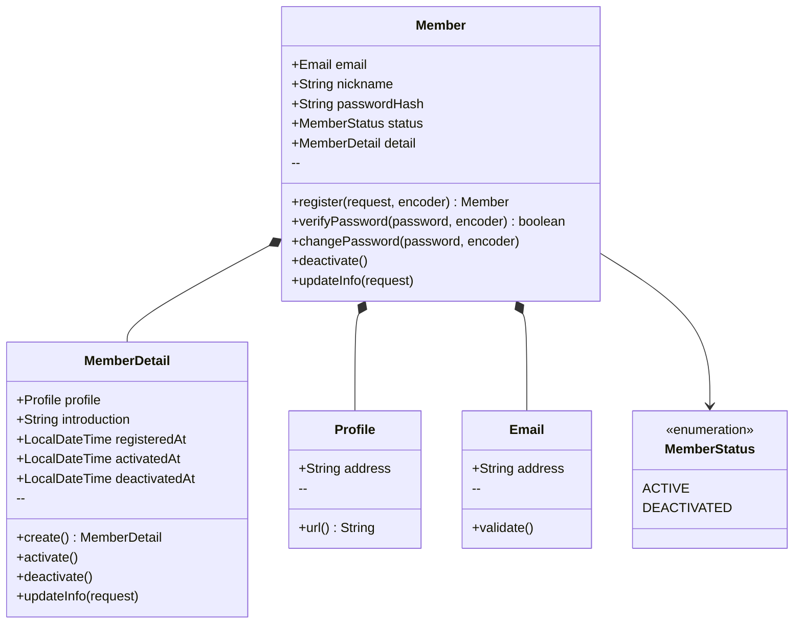
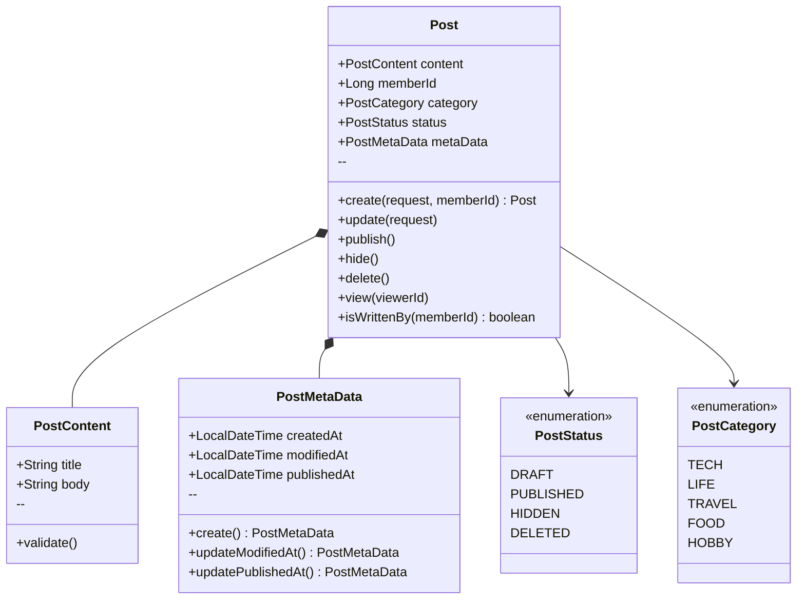
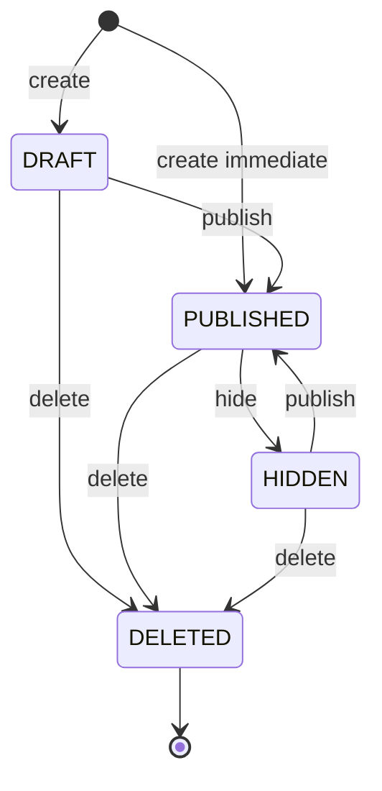
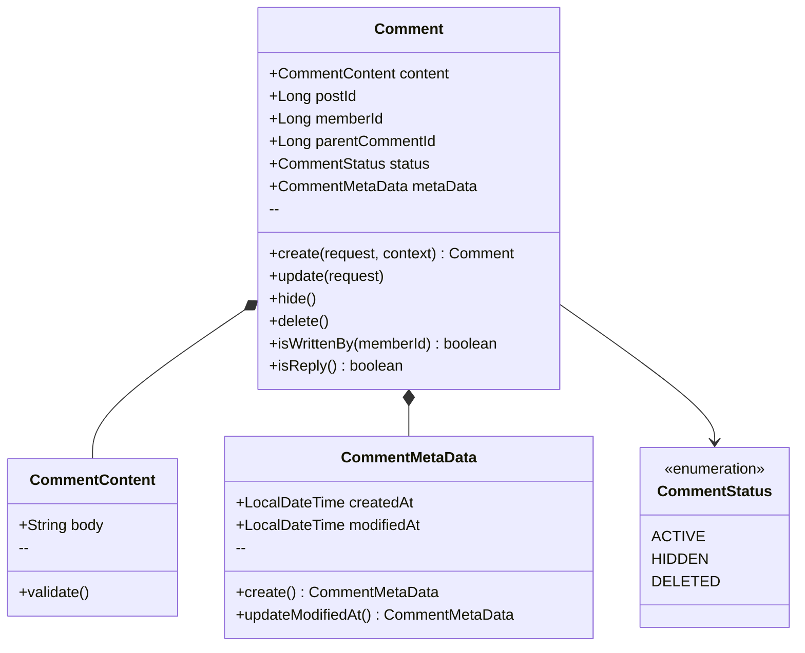
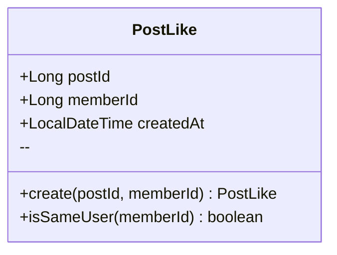
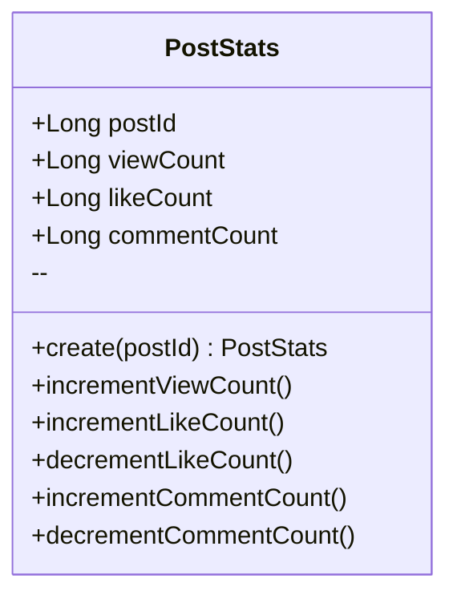
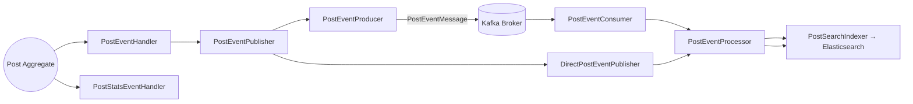
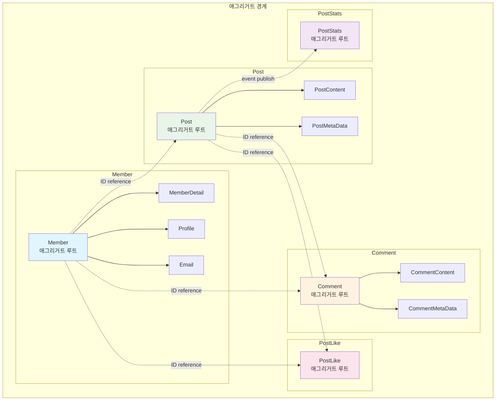

# See 프로젝트 도메인 모델 문서

## 개요

See 프로젝트는 소셜 커뮤니티 플랫폼으로, **도메인 모델 패턴**과 **헥사고날 아키텍처** 원칙을 적용하여 설계되었습니다. 비즈니스 복잡성을 도메인 모델로 명확하게 표현하고, 기술적 세부사항과 분리하여 유지보수성과 확장성을 확보했습니다.

## 전체 도메인 구조



## 핵심 도메인 개념

### 유비쿼터스 언어 (Ubiquitous Language)

| 도메인 용어 | 설명 | 영어 표현 |
|------------|------|-----------|
| **회원** | 플랫폼에 가입한 사용자 | Member |
| **포스트** | 회원이 작성한 글 | Post |
| **댓글** | 포스트에 달린 의견 | Comment |
| **좋아요** | 포스트에 대한 선호 표현 | Like |
| **프로필** | 회원의 공개 식별자 | Profile |
| **발행** | 초안을 공개 상태로 전환 | Publish |
| **숨김** | 공개된 글을 숨김 상태로 전환 | Hide |

## 회원(Member) 애그리거트

### 애그리거트 루트: Member



### 비즈니스 규칙

#### Member 엔티티
- **애그리거트 루트**: 회원 도메인의 진입점
- **자연키**: Email을 자연키로 사용 (@NaturalId)
- **상태 전이**: ACTIVE ↔ DEACTIVATED
- **불변 규칙**: 이메일 중복 불가, 닉네임 필수

#### MemberDetail 엔티티
- **생명주기**: Member와 동일 (CascadeType.ALL)
- **프로필 관리**: 선택적 프로필 주소 설정
- **시간 추적**: 가입/활성화/비활성화 시점 기록

#### Profile 값 객체
- **형식 규칙**: 영문 소문자, 숫자만 허용 (15자 이하)
- **URL 변환**: "@{address}" 형태로 표시
- **유일성**: 중복 불가 (도메인 제약)

#### Email 값 객체
- **형식 검증**: 정규식으로 유효한 이메일 형식 확인
- **불변성**: 생성 후 변경 불가
- **공유 사용**: 여러 애그리거트에서 재사용

### 도메인 서비스

```java
public interface PasswordEncoder {
    String encode(String rawPassword);
    boolean matches(String rawPassword, String encodedPassword);
}
```

## 포스트(Post) 애그리거트

### 애그리거트 루트: Post



### 상태 전이 규칙



### 비즈니스 규칙

#### Post 엔티티
- **작성자 권한**: 포스트를 작성한 회원만 수정/삭제 가능
- **상태 제한**: 각 상태에서 허용되는 전이만 가능
- **즉시 발행**: 생성 시 즉시 발행 여부 선택 가능
- **도메인 이벤트**: 생성, 수정, 발행, 숨김, 삭제 시 이벤트 발행

#### PostContent 값 객체
- **제목 필수**: 빈 제목 허용 안함
- **내용 필수**: 본문은 빈 내용 허용 안함, 최대 50,000자 제한
- **불변성**: 수정 시 새로운 인스턴스 생성

#### PostMetaData 값 객체
- **시간 추적**: 생성/수정/발행 시점 기록
- **자동 갱신**: 수정 시 modifiedAt 자동 업데이트
- **불변성**: 시점 정보는 생성 후 변경 불가
- **직렬화 지원**: Kafka 전송을 위해 관련 엔티티/값 객체(Post, PostContent, PostMetaData, Tag)는 모두 `Serializable`을 구현

## 댓글(Comment) 애그리거트

### 애그리거트 루트: Comment



### 비즈니스 규칙

#### Comment 엔티티
- **계층 구조**: parentCommentId로 대댓글 지원
- **작성자 권한**: 댓글을 작성한 회원만 수정/삭제 가능
- **상태 관리**: ACTIVE → HIDDEN → DELETED 순차 전이
- **빈 수정 방지**: 기존 내용과 동일한 수정 요청 거부

#### CommentContent 값 객체
- **내용 필수**: 빈 댓글 내용 허용 안함
- **길이 제한**: 최대 1000자 제한 (비즈니스 규칙)

## 좋아요(PostLike) 애그리거트

### 애그리거트 루트: PostLike



### 비즈니스 규칙

#### PostLike 엔티티
- **유일성 제약**: 동일한 회원은 같은 포스트에 하나의 좋아요만 가능
- **복합키**: postId + memberId로 식별
- **취소 가능**: 좋아요 취소(삭제) 지원

## 통계(PostStats) 애그리거트

### 애그리거트 루트: PostStats



### 비즈니스 규칙

#### PostStats 엔티티
- **독립적 관리**: Post와 별도 애그리거트로 성능 최적화
- **이벤트 기반 갱신**: 도메인 이벤트를 통한 비동기 통계 업데이트
- **음수 방지**: 카운트 값이 음수가 되지 않도록 보호

## 도메인 이벤트

### 포스트 관련 이벤트



도메인 이벤트는 Post 애그리거트에서 발행되며 `PostEventHandler`가 애플리케이션 이벤트로 수신합니다. 기본적으로 Kafka를 거쳐 `PostEventProcessor`가 Elasticsearch 색인을 갱신하고, 통계 관련 이벤트는 `PostStatsEventHandler`가 별도로 처리합니다. Kafka를 사용할 수 없는 경우 `DirectPostEventPublisher`가 동일한 프로세서를 직접 호출합니다.

### 이벤트 처리 규칙

#### 통계 업데이트
- **PostViewed**: 조회수 +1
- **PostLiked**: 좋아요 수 +1
- **PostUnliked**: 좋아요 수 -1
- **CommentCreated**: 댓글 수 +1
- **CommentDeleted**: 댓글 수 -1

## 도메인 제약사항

### 회원 도메인 제약사항

| 제약사항 | 설명 | 예외 |
|---------|------|-----|
| **이메일 유일성** | 동일한 이메일로는 하나의 계정만 생성 가능 | DuplicateEmailException |
| **프로필 유일성** | 동일한 프로필 주소는 하나의 계정만 사용 가능 | DuplicateProfileException |
| **이메일 형식** | RFC 5322 표준을 따르는 유효한 이메일 형식 | IllegalArgumentException |
| **프로필 형식** | 영문 소문자, 숫자, 15자 이하 | IllegalArgumentException |
| **닉네임 필수** | 빈 닉네임 허용 안함 | IllegalArgumentException |

### 포스트 도메인 제약사항

| 제약사항 | 설명 | 예외 |
|---------|------|-----|
| **제목 필수** | 빈 제목 허용 안함 | IllegalArgumentException |
| **작성자 권한** | 포스트 작성자만 수정/삭제 가능 | UnauthorizedPostAccessException |
| **상태 전이 규칙** | 정의된 상태 전이만 허용 | InvalidPostStatusTransitionException |
| **삭제된 포스트** | 삭제된 포스트는 더 이상 조작 불가 | InvalidPostStatusTransitionException |

### 댓글 도메인 제약사항

| 제약사항 | 설명 | 예외 |
|---------|------|-----|
| **내용 필수** | 빈 댓글 내용 허용 안함 | IllegalArgumentException |
| **작성자 권한** | 댓글 작성자만 수정/삭제 가능 | UnauthorizedCommentAccessException |
| **빈 수정 방지** | 기존과 동일한 내용으로 수정 불가 | EmptyCommentUpdateException |
| **상태 제한** | 삭제된 댓글은 수정 불가 | InvalidCommentStatusException |

## 아키텍처 원칙 적용

### 1. 애그리거트 경계 설정



#### 경계 설정 원칙
- **트랜잭션 경계**: 하나의 애그리거트 = 하나의 트랜잭션
- **일관성 경계**: 애그리거트 내부는 강한 일관성, 외부는 최종 일관성
- **ID 참조**: 애그리거트 간 참조는 객체 참조가 아닌 ID 참조 사용
- **이벤트 기반**: PostStats는 Post 이벤트를 통해 비동기 업데이트

### 2. 도메인 서비스 활용

```java
// 도메인 서비스 - 비밀번호 암호화
public interface PasswordEncoder {
    String encode(String rawPassword);
    boolean matches(String rawPassword, String encodedPassword);
}

// 구현체는 Adapter 레이어에 위치
@Component
public class SecurePasswordEncoder implements PasswordEncoder {
    private final BCryptPasswordEncoder encoder = new BCryptPasswordEncoder();
    // ...
}
```

### 3. 값 객체 적극 활용

#### 원시 타입 포장 (Primitive Obsession 제거)

```java
// ❌ 원시 타입 사용
public class Member {
    private String email;  // 검증 로직 없음
    private String profile; // 형식 제한 없음
}

// ✅ 값 객체 사용
public class Member {
    private Email email;    // 검증 로직 포함
    private Profile profile; // 형식 제한 포함
}
```

#### 값 객체 장점
- **캡슐화**: 검증 로직을 값 객체 내부에 포함
- **재사용성**: 여러 애그리거트에서 동일한 값 객체 사용
- **표현력**: 도메인 개념을 명확하게 표현
- **불변성**: 생성 후 변경 불가능으로 안전성 보장

### 4. 도메인 이벤트 활용

#### 이벤트 발행 패턴

```java
public class Post extends AbstractAggregateRoot {
    public void publish() {
        // 비즈니스 로직 실행
        this.status = PostStatus.PUBLISHED;
        this.metaData = this.metaData.updatePublishedAt();

        // 도메인 이벤트 발행
        this.addDomainEvent(new PostPublished(this.getId(), this.memberId));
    }
}
```

#### 이벤트 처리 패턴

```java
@Component
@RequiredArgsConstructor
public class PostEventHandler {

    private final PostEventPublisher postEventPublisher;

    @EventListener
    public void handlePostCreated(PostCreated event) {
        postEventPublisher.publish(event);
    }

    @EventListener
    public void handlePostUpdated(PostUpdated event) {
        postEventPublisher.publish(event);
    }

    @EventListener
    public void handlePostDeleted(PostDeleted event) {
        postEventPublisher.publish(event);
    }
}

@Component
@ConditionalOnProperty(value = "see.kafka.enabled", havingValue = "true")
@RequiredArgsConstructor
public class PostEventProducer implements PostEventPublisher {
    private final KafkaTemplate<String, PostEventMessage> kafkaTemplate;
    private final RetryTemplate retryTemplate;

    @Value("${see.kafka.topics.post-events:post-events}")
    private String topic;

    @Override
    public void publish(DomainEvent event) {
        PostEventMessage message = PostEventMessage.from(event);
        String key = message.postId().toString();

        Runnable sender = () -> retryTemplate.execute(ctx -> {
            kafkaTemplate.send(topic, key, message).get();
            return null;
        }, recovery -> {
            throw new IllegalStateException("Kafka 전송 실패", recovery.getLastThrowable());
        });

        if (TransactionSynchronizationManager.isSynchronizationActive()) {
            TransactionSynchronizationManager.registerSynchronization(new TransactionSynchronization() {
                @Override
                public void afterCommit() {
                    sender.run();
                }
            });
        } else {
            sender.run();
        }
    }
}

@Component
@RequiredArgsConstructor
class PostEventProcessor {
    private final PostRepository postRepository;
    private final PostSearchIndexer indexer;

    void process(PostEventMessage message) {
        switch (message.type()) {
            case CREATED, UPDATED -> postRepository.findById(message.postId())
                    .ifPresent(indexer::index);
            case DELETED -> indexer.delete(message.postId());
        }
    }
}
```

Kafka를 사용할 수 없는 환경에서는 `see.kafka.enabled=false`로 설정하여 `DirectPostEventPublisher`가 즉시 `PostEventProcessor`를 호출하도록 구성했습니다.

#### 이벤트 처리 원칙
- **트랜잭션 후처리**: Kafka 전송은 커밋 이후 `TransactionSynchronization`을 통해 수행
- **메시지 키**: `postId`를 메시지 키로 사용해 파티션 내 순서를 보장
- **재시도 정책**: `RetryTemplate`으로 최대 3회 재시도 후 실패를 호출자에게 전달
- **컨슈머 에러 처리**: `DefaultErrorHandler`가 적용된 리스너 컨테이너로 재처리/로그를 관리
- **Fallback 보장**: Kafka 비활성화 시에도 동일한 이벤트 플로우를 직접 실행
- **테스트 격리**: Embedded Kafka 통합 테스트에서는 `${random.uuid}` 그룹 ID로 소비자를 분리

### 5. 헥사고날 아키텍처 적용

#### 포트와 어댑터 분리

```java
// Primary Port (Application Layer)
public interface MemberRegister {
    Member register(MemberRegisterRequest request);
    Member activate(Long memberId);
}

// Secondary Port (Application Layer)  
public interface MemberRepository {
    Member save(Member member);
    Optional<Member> findByEmail(Email email);
}

// Primary Adapter (Web Layer)
@RestController
public class MemberApi {
    private final MemberRegister memberRegister;
    // ...
}

// Secondary Adapter (Persistence Layer)
@Repository
public class JpaMemberRepository implements MemberRepository {
    // JPA 구현
}
```

## 성능 고려사항

### 1. 애그리거트 크기 최적화
- **PostStats 분리**: Post와 별도 애그리거트로 성능 최적화
- **지연 로딩**: 불필요한 데이터 로딩 방지
- **N+1 문제 방지**: 적절한 페치 전략 사용

### 2. 이벤트 기반 비동기 처리
- **통계 업데이트**: 실시간이 아닌 이벤트 기반 비동기 처리
- **트랜잭션 분리**: 통계 업데이트 실패가 본 작업에 영향 없음
- **최종 일관성**: 통계는 최종 일관성으로 충분

### 3. 캐싱 전략
- **읽기 전용 데이터**: 카테고리, 상태 등 정적 데이터 캐싱
- **자주 조회되는 데이터**: 인기 포스트, 회원 프로필 등
- **캐시 무효화**: 데이터 변경 시 관련 캐시 무효화

## 진화 계획

### Phase 1: 현재 구현
- ✅ 기본 회원/포스트/댓글 기능
- ✅ 헥사고날 아키텍처 적용
- ✅ 도메인 이벤트 기본 구현

### Phase 2: 확장 기능
- 📋 태그 시스템 (Tag 애그리거트)
- 📋 팔로우 시스템 (Follow 애그리거트)
- 📋 알림 시스템 (Notification 애그리거트)
- 📋 검색 기능 (Search 바운디드 컨텍스트)

### Phase 3: 고도화
- 📋 CQRS 패턴 적용 (읽기/쓰기 분리)
- 📋 이벤트 소싱 도입
- 📋 마이크로서비스 분리
- 📋 실시간 기능 (WebSocket, SSE)

## 비즈니스 가치 제공

### 1. 사용자 관점
- **직관적인 인터페이스**: 도메인 용어가 그대로 API에 반영
- **안전한 데이터**: 강한 타입 시스템과 검증으로 데이터 무결성 보장
- **빠른 응답**: 효율적인 애그리거트 설계로 성능 최적화

### 2. 개발자 관점
- **명확한 비즈니스 로직**: 도메인 모델에 비즈니스 규칙이 명시적으로 표현
- **높은 응집도**: 관련된 데이터와 행위가 함께 위치
- **낮은 결합도**: 애그리거트 간 독립성으로 변경 영향 최소화

### 3. 비즈니스 관점
- **요구사항 추적 가능**: 도메인 모델과 비즈니스 요구사항의 직접적 매핑
- **변경 용이성**: 비즈니스 규칙 변경 시 도메인 모델만 수정
- **확장 가능성**: 새로운 기능 추가 시 기존 구조 유지

---

## 참고 자료

- **Domain-Driven Design** by Eric Evans
- **Implementing Domain-Driven Design** by Vaughn Vernon
- **Clean Architecture** by Robert C. Martin
- **Spring Data JPA 레퍼런스**
- **헥사고날 아키텍처 가이드**

이 도메인 모델 문서는 See 프로젝트의 핵심 비즈니스 로직과 설계 원칙을 담고 있습니다. 지속적인 도메인 지식 발견과 함께 문서도 함께 발전시켜 나가야 합니다.
