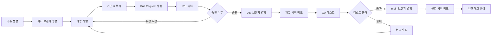

# See 프로젝트 용어 사전

## 📋 개요

이 문서는 See 프로젝트에서 사용하는 **도메인 용어**, **기술 용어**, **아키텍처 용어**들을 정리한 용어사전입니다. 팀원 간의 원활한 소통과 새로운 팀원의 빠른 적응을 위해 작성되었습니다.

## 🏢 비즈니스 도메인 용어

### 👤 회원 관련 용어

| 한국어 | 영어 | 정의 | 사용 예시 |
|--------|------|------|-----------|
| **회원** | Member | 플랫폼에 가입하고 인증된 사용자 | "회원이 포스트를 작성할 수 있습니다" |
| **회원 가입** | Registration | 새로운 사용자가 플랫폼에 계정을 생성하는 과정 | "회원 가입 시 이메일 인증이 필요합니다" |
| **로그인** | Authentication | 기존 회원이 자격 증명을 통해 시스템에 접근하는 과정 | "로그인 후 모든 기능을 이용할 수 있습니다" |
| **프로필** | Profile | 회원의 공개 식별자 및 정보 | "프로필 주소는 @username 형태입니다" |
| **닉네임** | Nickname | 회원의 표시 이름 | "닉네임은 중복 가능하지만 프로필은 유일합니다" |
| **활성 상태** | Active Status | 현재 사용 가능한 회원 계정 상태 | "활성 상태의 회원만 포스트 작성이 가능합니다" |
| **비활성화** | Deactivation | 회원이 자발적으로 계정을 일시 중지하는 행위 | "비활성화된 계정은 복구 가능합니다" |

### 📝 콘텐츠 관련 용어

| 한국어 | 영어 | 정의 | 사용 예시 |
|--------|------|------|-----------|
| **포스트** | Post | 회원이 작성한 글 또는 게시물 | "포스트에는 제목과 내용이 포함됩니다" |
| **초안** | Draft | 아직 공개되지 않은 작성 중인 포스트 | "초안 상태에서 언제든 수정 가능합니다" |
| **발행** | Publish | 초안을 공개 상태로 전환하는 행위 | "발행된 포스트는 모든 사용자가 볼 수 있습니다" |
| **숨김** | Hide | 공개된 포스트를 임시로 비공개 상태로 전환 | "숨김 처리된 포스트는 작성자만 볼 수 있습니다" |
| **삭제** | Delete | 포스트를 영구적으로 제거하는 행위 | "삭제된 포스트는 복구할 수 없습니다" |
| **카테고리** | Category | 포스트를 분류하는 주제별 그룹 | "기술, 라이프, 여행 등의 카테고리가 있습니다" |
| **조회수** | View Count | 포스트가 조회된 횟수 | "조회수는 실시간으로 증가합니다" |

### 💬 소통 관련 용어

| 한국어 | 영어 | 정의 | 사용 예시 |
|--------|------|------|-----------|
| **댓글** | Comment | 포스트에 대한 회원의 의견이나 반응 | "댓글을 통해 포스트 작성자와 소통할 수 있습니다" |
| **대댓글** | Reply | 기존 댓글에 대한 응답 댓글 | "대댓글로 세부적인 토론이 가능합니다" |
| **댓글 스레드** | Comment Thread | 원댓글과 그에 달린 대댓글들의 계층 구조 | "댓글 스레드는 최대 3단계까지 지원합니다" |
| **좋아요** | Like | 포스트에 대한 긍정적 반응 표시 | "좋아요는 포스트 인기도를 나타내는 지표입니다" |
| **좋아요 취소** | Unlike | 이전에 표시한 좋아요를 철회하는 행위 | "좋아요 취소는 언제든 가능합니다" |

## 🏗️ 아키텍처 용어

### 헥사고날 아키텍처 (Ports & Adapters)

| 한국어 | 영어 | 정의 | 사용 예시 |
|--------|------|------|-----------|
| **헥사고날 아키텍처** | Hexagonal Architecture | 애플리케이션 코어를 외부 의존성으로부터 분리하는 아키텍처 패턴 | "헥사고날 아키텍처로 비즈니스 로직을 보호합니다" |
| **포트** | Port | 애플리케이션과 외부 세계 간의 인터페이스 | "포트는 어댑터의 구현 계약을 정의합니다" |
| **어댑터** | Adapter | 포트 인터페이스를 구현하여 외부 시스템과 연결하는 구현체 | "웹 어댑터는 HTTP 요청을 비즈니스 로직으로 전달합니다" |
| **Primary Port** | Primary Port | 외부에서 애플리케이션으로 들어오는 인터페이스 | "REST API는 Primary Port를 통해 노출됩니다" |
| **Secondary Port** | Secondary Port | 애플리케이션에서 외부로 나가는 인터페이스 | "데이터베이스 접근은 Secondary Port를 통해 이뤄집니다" |
| **Primary Adapter** | Primary Adapter | 외부 요청을 받아 애플리케이션을 호출하는 어댑터 | "웹 컨트롤러는 Primary Adapter입니다" |
| **Secondary Adapter** | Secondary Adapter | 애플리케이션의 요청으로 외부 시스템을 호출하는 어댑터 | "JPA Repository는 Secondary Adapter입니다" |

### 계층 구조

| 한국어 | 영어 | 정의 | 사용 예시 |
|--------|------|------|-----------|
| **도메인 계층** | Domain Layer | 비즈니스 규칙과 도메인 로직을 포함하는 핵심 계층 | "도메인 계층은 외부 의존성이 없어야 합니다" |
| **애플리케이션 계층** | Application Layer | 유스케이스를 구현하고 도메인 객체들을 조율하는 계층 | "애플리케이션 계층에서 트랜잭션을 관리합니다" |
| **어댑터 계층** | Adapter Layer | 외부 시스템과의 연동을 담당하는 계층 | "어댑터 계층에는 웹, 데이터베이스, 보안 어댑터가 있습니다" |
| **인프라스트럭처 계층** | Infrastructure Layer | 기술적 구현 세부사항을 담당하는 계층 | "인프라스트럭처 계층은 어댑터 계층과 유사합니다" |

## 🎯 DDD (Domain-Driven Design) 용어

### 전략적 설계

| 한국어 | 영어 | 정의 | 사용 예시 |
|--------|------|------|-----------|
| **도메인** | Domain | 소프트웨어가 해결하고자 하는 문제 영역 | "소셜 블로깅이 우리 프로젝트의 도메인입니다" |
| **서브도메인** | Subdomain | 도메인을 구성하는 하위 문제 영역 | "회원 관리, 콘텐츠 관리는 각각 서브도메인입니다" |
| **바운디드 컨텍스트** | Bounded Context | 특정 도메인 모델이 적용되는 경계 | "회원 컨텍스트와 포스트 컨텍스트는 분리되어 있습니다" |
| **유비쿼터스 언어** | Ubiquitous Language | 도메인 전문가와 개발자가 공유하는 공통 언어 | "유비쿼터스 언어로 코드와 대화에서 같은 용어를 사용합니다" |
| **컨텍스트 맵** | Context Map | 바운디드 컨텍스트 간의 관계를 표현하는 다이어그램 | "컨텍스트 맵으로 시스템 전체 구조를 파악합니다" |

### 전술적 설계

| 한국어 | 영어 | 정의 | 사용 예시 |
|--------|------|------|-----------|
| **애그리거트** | Aggregate | 데이터 변경의 단위가 되는 관련 객체들의 클러스터 | "Member는 MemberDetail과 함께 하나의 애그리거트입니다" |
| **애그리거트 루트** | Aggregate Root | 애그리거트의 진입점이 되는 엔티티 | "Member는 회원 애그리거트의 루트입니다" |
| **엔티티** | Entity | 고유한 식별자를 가진 도메인 객체 | "Member와 Post는 엔티티입니다" |
| **값 객체** | Value Object | 식별자가 없고 값으로만 구분되는 불변 객체 | "Email과 Profile은 값 객체입니다" |
| **도메인 서비스** | Domain Service | 특정 엔티티에 속하지 않는 도메인 로직을 담는 서비스 | "PasswordEncoder는 도메인 서비스입니다" |
| **도메인 이벤트** | Domain Event | 도메인에서 발생하는 중요한 사건을 나타내는 객체 | "PostPublished는 포스트 발행 시 발생하는 도메인 이벤트입니다" |
| **리포지토리** | Repository | 애그리거트의 저장과 조회를 담당하는 인터페이스 | "MemberRepository는 회원 정보의 영속성을 추상화합니다" |

## 🛠️ 기술 용어

### Spring Framework

| 한국어 | 영어 | 정의 | 사용 예시 |
|--------|------|------|-----------|
| **의존성 주입** | Dependency Injection | 객체의 의존성을 외부에서 주입하는 패턴 | "Spring은 의존성 주입을 통해 객체 간 결합도를 낮춥니다" |
| **제어의 역전** | Inversion of Control | 프레임워크가 객체의 생명주기를 관리하는 원칙 | "IoC 컨테이너가 빈의 생성과 소멸을 담당합니다" |
| **빈** | Bean | Spring 컨테이너가 관리하는 객체 | "서비스 클래스는 Spring 빈으로 등록됩니다" |
| **애플리케이션 컨텍스트** | Application Context | Spring의 IoC 컨테이너 | "애플리케이션 컨텍스트에서 빈을 조회할 수 있습니다" |
| **AOP** | Aspect-Oriented Programming | 관점 지향 프로그래밍, 횡단 관심사 분리 | "트랜잭션 관리는 AOP로 구현됩니다" |

### JPA/Hibernate

| 한국어 | 영어 | 정의 | 사용 예시 |
|--------|------|------|-----------|
| **ORM** | Object-Relational Mapping | 객체와 관계형 데이터베이스 간의 매핑 기술 | "JPA는 Java의 표준 ORM 기술입니다" |
| **영속성 컨텍스트** | Persistence Context | 엔티티를 관리하는 JPA의 1차 캐시 | "영속성 컨텍스트에서 엔티티 상태를 추적합니다" |
| **지연 로딩** | Lazy Loading | 연관된 데이터를 실제 사용 시점에 로딩하는 전략 | "지연 로딩으로 불필요한 데이터 로딩을 방지합니다" |
| **즉시 로딩** | Eager Loading | 연관된 데이터를 즉시 로딩하는 전략 | "즉시 로딩은 N+1 문제를 일으킬 수 있습니다" |
| **자연키** | Natural Id | 비즈니스적 의미를 가진 식별자 | "이메일을 자연키로 사용합니다" |
| **대리키** | Surrogate Key | 비즈니스와 무관한 인조 식별자 | "ID 필드는 대리키입니다" |

### 보안

| 한국어 | 영어 | 정의 | 사용 예시 |
|--------|------|------|-----------|
| **JWT** | JSON Web Token | JSON 기반의 웹 토큰 표준 | "JWT로 stateless 인증을 구현합니다" |
| **BCrypt** | BCrypt | 비밀번호 해싱을 위한 암호화 알고리즘 | "BCrypt로 비밀번호를 안전하게 저장합니다" |
| **인증** | Authentication | 사용자의 신원을 확인하는 과정 | "로그인 시 인증 과정을 거칩니다" |
| **인가** | Authorization | 인증된 사용자의 권한을 확인하는 과정 | "포스트 수정은 작성자만 인가됩니다" |
| **솔트** | Salt | 해시 함수에 추가하는 임의의 데이터 | "솔트를 사용해 레인보우 테이블 공격을 방지합니다" |

## 🧪 테스트 용어

### 테스트 유형

| 한국어 | 영어 | 정의 | 사용 예시 |
|--------|------|------|-----------|
| **단위 테스트** | Unit Test | 개별 컴포넌트나 모듈을 독립적으로 테스트 | "도메인 객체는 단위 테스트로 검증합니다" |
| **통합 테스트** | Integration Test | 여러 컴포넌트 간의 상호작용을 테스트 | "데이터베이스 연동은 통합 테스트로 검증합니다" |
| **E2E 테스트** | End-to-End Test | 전체 시스템의 워크플로우를 테스트 | "사용자 시나리오를 E2E 테스트로 검증합니다" |
| **아키텍처 테스트** | Architecture Test | 코드 구조와 아키텍처 규칙을 검증하는 테스트 | "ArchUnit으로 헥사고날 아키텍처를 검증합니다" |

### 테스트 기법

| 한국어 | 영어 | 정의 | 사용 예시 |
|--------|------|------|-----------|
| **TDD** | Test-Driven Development | 테스트를 먼저 작성하고 구현하는 개발 방법론 | "TDD로 도메인 로직을 개발합니다" |
| **BDD** | Behavior-Driven Development | 행위 중심의 테스트 개발 방법론 | "BDD로 사용자 시나리오를 명세합니다" |
| **목 객체** | Mock Object | 테스트에서 실제 객체를 대신하는 가짜 객체 | "외부 의존성은 목 객체로 대체합니다" |
| **스텁** | Stub | 미리 정해진 응답을 반환하는 가짜 객체 | "API 응답을 스텁으로 시뮬레이션합니다" |
| **테스트 픽스처** | Test Fixture | 테스트 실행을 위한 고정된 환경이나 데이터 | "회원 테스트 픽스처를 재사용합니다" |

### 테스트 지표

| 한국어 | 영어 | 정의 | 사용 예시 |
|--------|------|------|-----------|
| **테스트 커버리지** | Test Coverage | 테스트가 실행된 코드의 비율 | "라인 커버리지 80% 이상을 유지합니다" |
| **라인 커버리지** | Line Coverage | 실행된 코드 라인의 비율 | "라인 커버리지는 가장 기본적인 지표입니다" |
| **브랜치 커버리지** | Branch Coverage | 모든 분기(조건문)가 실행된 비율 | "브랜치 커버리지로 조건 로직을 검증합니다" |
| **뮤테이션 테스팅** | Mutation Testing | 코드를 변경해서 테스트 품질을 측정하는 기법 | "뮤테이션 테스팅으로 테스트의 효과를 검증합니다" |

## 🔧 개발 프로세스 용어

### Git 워크플로우

| 한국어 | 영어 | 정의 | 사용 예시 |
|--------|------|------|-----------|
| **이슈** | Issue | 작업 항목, 버그, 기능 요청 등을 추적하는 단위 | "새로운 기능은 이슈를 먼저 생성합니다" |
| **브랜치** | Branch | 코드의 독립적인 개발 라인 | "기능별로 브랜치를 분리해서 개발합니다" |
| **피처 브랜치** | Feature Branch | 새로운 기능을 개발하는 브랜치 | "feature/login-api 브랜치에서 로그인 기능을 개발합니다" |
| **개발 브랜치** | Development Branch | 개발 중인 변경사항들이 통합되는 브랜치 | "dev 브랜치는 개발 서버에 배포됩니다" |
| **배포 브랜치** | Production Branch | 운영 환경에 배포되는 안정화된 브랜치 | "main 브랜치는 운영 서버에 배포됩니다" |
| **커밋** | Commit | 변경사항을 저장소에 기록하는 행위 | "의미 있는 단위로 커밋을 나눕니다" |
| **푸시** | Push | 로컬 변경사항을 원격 저장소에 업로드 | "피처 브랜치를 원격에 푸시합니다" |
| **풀 리퀘스트** | Pull Request (PR) | 코드 변경사항을 병합하기 전 리뷰 요청 | "PR을 생성하여 코드 리뷰를 요청합니다" |
| **코드 리뷰** | Code Review | 다른 개발자가 작성한 코드를 검토하는 과정 | "모든 PR은 최소 1명의 리뷰어 승인이 필요합니다" |
| **머지** | Merge | 브랜치의 변경사항을 다른 브랜치에 통합 | "PR 승인 후 dev 브랜치로 머지합니다" |
| **리베이스** | Rebase | 커밋 히스토리를 재정렬하는 작업 | "리베이스로 커밋 히스토리를 깔끔하게 유지합니다" |
| **컨플릭트** | Conflict | 병합 시 발생하는 코드 충돌 | "컨플릭트 발생 시 수동으로 해결해야 합니다" |
| **태그** | Tag | 특정 커밋을 표시하는 참조 포인터 | "배포 시점마다 버전 태그를 생성합니다" |

### See 프로젝트 Git 워크플로우

#### 워크플로우 단계별 설명

1. **이슈 생성**: GitHub Issues에 작업 항목 등록
    - 예: `Member Primary Adapter 구현`

2. **피처 브랜치 생성**: 이슈 번호를 포함한 브랜치 생성
    - 네이밍: `feat#1-MemberPrimaryAdapter`

3. **기능 개발**: 피처 브랜치에서 개발 진행
    - 작은 단위로 자주 커밋

4. **커밋 & 푸시**: 로컬 변경사항을 원격에 업로드
    - 커밋 메시지 작성 규칙:
      - 첫 번째 줄: 50자 이내의 간결한 요약 (type(scope): subject 형식)
        - type: feat, fix, docs, style, refactor, test, chore 등
        - scope: 변경된 모듈/컴포넌트 (선택사항)
        - subject: 동사원형으로 시작, 첫 글자 소문자
        - 이해하기 쉬운 영어로 작성 
      - 두 번째 줄: 빈 줄 
      - 본문: 72자로 줄바꿈하여 작성 
        - 무엇을, 왜 변경했는지 설명 
        - 어떻게 구현했는지보다는 비즈니스 맥락과 이유에 집중
        - 간결한 한글로 작성

5. **Pull Request 생성**: dev 브랜치로의 병합 요청
    - PR 템플릿에 따라 상세 설명 작성

6. **코드 리뷰**: CodeRabbit 피드백

7. **dev 브랜치 병합**: 승인된 PR을 개발 브랜치에 통합
    - Merge Commit 사용

8. **개발 서버 배포**: dev 브랜치를 개발 환경에 자동 배포
    - CI/CD 파이프라인 자동 실행

9. **QA 테스트**: 개발 서버에서 기능 검증
    - 통합 테스트 및 수동 테스트

10. **main 브랜치 병합**: 검증 완료 후 운영 브랜치에 병합
    - Release PR 생성 및 승인

11. **운영 서버 배포**: main 브랜치를 프로덕션에 배포
    - 배포 스크립트 자동 실행

### CI/CD 용어

| 한국어 | 영어 | 정의 | 사용 예시 |
|--------|------|------|-----------|
| **지속적 통합** | Continuous Integration | 코드 변경사항을 자동으로 빌드하고 테스트하는 프랙티스 | "CI 파이프라인에서 자동으로 테스트가 실행됩니다" |
| **지속적 배포** | Continuous Deployment | 검증된 코드를 자동으로 운영 환경에 배포 | "CD를 통해 배포 주기를 단축합니다" |
| **파이프라인** | Pipeline | 빌드, 테스트, 배포의 자동화된 흐름 | "GitHub Actions로 CI/CD 파이프라인을 구성합니다" |
| **빌드** | Build | 소스 코드를 실행 가능한 형태로 변환 | "Gradle로 프로젝트를 빌드합니다" |
| **아티팩트** | Artifact | 빌드 결과물 | "JAR 파일이 빌드 아티팩트입니다" |
| **배포 환경** | Environment | 애플리케이션이 실행되는 환경 | "개발, 스테이징, 운영 환경으로 구분합니다" |

### 코드 컨벤션

| 한국어 | 영어 | 정의 | 사용 예시 |
|--------|------|------|-----------|
| **코드 스타일** | Code Style | 코드 작성 시 따르는 형식 규칙 | "Google Java Style Guide를 따릅니다" |
| **린터** | Linter | 코드 스타일과 잠재적 오류를 검사하는 도구 | "Checkstyle로 코드 스타일을 검증합니다" |
| **포매터** | Formatter | 코드를 일관된 형식으로 자동 정리하는 도구 | "IntelliJ 포매터로 코드를 자동 정렬합니다" |
| **네이밍 컨벤션** | Naming Convention | 변수, 클래스 등의 이름 짓기 규칙 | "클래스명은 PascalCase, 메서드명은 camelCase를 사용합니다" |

## 📊 프로젝트 관리 용어

### 애자일/스크럼

| 한국어 | 영어 | 정의 | 사용 예시 |
|--------|------|------|-----------|
| **스프린트** | Sprint | 고정된 기간의 개발 주기 | "2주 단위로 스프린트를 진행합니다" |
| **백로그** | Backlog | 구현해야 할 기능들의 목록 | "제품 백로그에서 우선순위가 높은 항목부터 처리합니다" |
| **유저 스토리** | User Story | 사용자 관점에서 기술한 기능 요구사항 | "회원으로서 로그인하여 포스트를 작성하고 싶다" |
| **스탠드업 미팅** | Stand-up Meeting | 짧은 일일 진행 상황 공유 회의 | "매일 아침 10시에 스탠드업 미팅을 진행합니다" |
| **회고** | Retrospective | 스프린트 종료 후 개선점을 논의하는 회의 | "회고를 통해 팀의 협업 방식을 개선합니다" |
| **데일리 스크럼** | Daily Scrum | 매일 진행하는 짧은 팀 동기화 미팅 | "데일리 스크럼에서 어제 한 일, 오늘 할 일, 장애물을 공유합니다" |
| **베로시티** | Velocity | 스프린트에서 완료한 작업량 | "팀의 베로시티를 기반으로 다음 스프린트를 계획합니다" |

### 문서화

| 한국어 | 영어 | 정의 | 사용 예시 |
|--------|------|------|-----------|
| **README** | README | 프로젝트 개요와 시작 가이드를 담은 문서 | "README에 프로젝트 설정 방법을 기술합니다" |
| **API 문서** | API Documentation | API의 엔드포인트와 사용법을 설명하는 문서 | "Swagger로 API 문서를 자동 생성합니다" |
| **ADR** | Architecture Decision Record | 아키텍처 결정 사항과 그 이유를 기록한 문서 | "헥사고날 아키텍처 도입을 ADR로 문서화했습니다" |
| **RFC** | Request for Comments | 기술적 결정을 위한 제안 및 토론 문서 | "새로운 기능 설계를 RFC로 작성하여 팀과 공유합니다" |

## 🔒 보안 및 인증 용어

### 인증/인가

| 한국어 | 영어 | 정의 | 사용 예시 |
|--------|------|------|-----------|
| **세션** | Session | 서버에 저장되는 사용자 상태 정보 | "세션 기반 인증은 서버 메모리를 사용합니다" |
| **토큰** | Token | 인증 정보를 담고 있는 암호화된 문자열 | "JWT 토큰으로 stateless 인증을 구현합니다" |
| **액세스 토큰** | Access Token | API 접근을 위한 단기 유효 토큰 | "액세스 토큰의 유효기간은 1시간입니다" |
| **리프레시 토큰** | Refresh Token | 액세스 토큰 갱신을 위한 장기 유효 토큰 | "리프레시 토큰으로 재로그인 없이 토큰을 갱신합니다" |
| **CORS** | Cross-Origin Resource Sharing | 다른 도메인 간 리소스 공유를 제어하는 메커니즘 | "CORS 설정으로 허용된 도메인만 API 접근 가능합니다" |

### 암호화

| 한국어 | 영어 | 정의 | 사용 예시 |
|--------|------|------|-----------|
| **해싱** | Hashing | 데이터를 고정 길이의 값으로 변환하는 단방향 암호화 | "비밀번호는 해싱하여 저장합니다" |
| **솔팅** | Salting | 해시 함수에 임의의 값을 추가하는 기법 | "솔팅으로 동일한 비밀번호도 다른 해시값을 갖습니다" |
| **암호화** | Encryption | 데이터를 암호문으로 변환하는 양방향 암호화 | "민감한 개인정보는 암호화하여 저장합니다" |
| **복호화** | Decryption | 암호문을 원래 데이터로 복원 | "복호화 키가 있어야 원본 데이터를 확인할 수 있습니다" |

## 📈 성능 및 모니터링 용어

### 성능

| 한국어 | 영어 | 정의 | 사용 예시 |
|--------|------|------|-----------|
| **캐싱** | Caching | 자주 사용되는 데이터를 임시 저장하여 성능 향상 | "Redis로 조회 성능을 개선합니다" |
| **인덱스** | Index | 데이터베이스 조회 속도를 높이는 자료구조 | "이메일 컬럼에 인덱스를 생성했습니다" |
| **페이지네이션** | Pagination | 대량의 데이터를 페이지 단위로 나누어 조회 | "포스트 목록은 페이지네이션으로 조회합니다" |
| **N+1 문제** | N+1 Problem | 연관 데이터 조회 시 발생하는 과도한 쿼리 문제 | "Fetch Join으로 N+1 문제를 해결합니다" |
| **쿼리 최적화** | Query Optimization | 데이터베이스 쿼리 성능을 개선하는 작업 | "인덱스와 조인 최적화로 쿼리 성능을 향상시킵니다" |

### 모니터링

| 한국어 | 영어 | 정의 | 사용 예시 |
|--------|------|------|-----------|
| **로깅** | Logging | 애플리케이션 실행 중 발생하는 이벤트 기록 | "Slf4j로 로그를 기록합니다" |
| **메트릭** | Metrics | 시스템의 성능 지표 | "CPU 사용률, 메모리 사용량 등의 메트릭을 수집합니다" |
| **알림** | Alert | 특정 임계값 초과 시 발생하는 경고 | "에러율이 5%를 넘으면 알림이 발생합니다" |
| **대시보드** | Dashboard | 시스템 상태를 시각화한 화면 | "Grafana 대시보드로 실시간 모니터링합니다" |
| **APM** | Application Performance Monitoring | 애플리케이션 성능 모니터링 도구 | "APM으로 병목 지점을 파악합니다" |

## 🗄️ 데이터베이스 용어

### 데이터베이스 개념

| 한국어 | 영어 | 정의 | 사용 예시 |
|--------|------|------|-----------|
| **트랜잭션** | Transaction | 데이터베이스의 작업 단위 | "트랜잭션 내에서 모든 작업이 성공하거나 실패합니다" |
| **ACID** | ACID | 트랜잭션의 4가지 속성 (원자성, 일관성, 고립성, 지속성) | "ACID 속성을 보장하여 데이터 무결성을 유지합니다" |
| **정규화** | Normalization | 데이터 중복을 최소화하는 데이터베이스 설계 기법 | "3차 정규화까지 적용했습니다" |
| **외래키** | Foreign Key | 다른 테이블의 기본키를 참조하는 컬럼 | "memberId는 Member 테이블의 외래키입니다" |
| **제약조건** | Constraint | 데이터 무결성을 보장하는 규칙 | "UNIQUE 제약조건으로 중복을 방지합니다" |

### 데이터베이스 작업

| 한국어 | 영어 | 정의 | 사용 예시 |
|--------|------|------|-----------|
| **마이그레이션** | Migration | 데이터베이스 스키마 변경 작업 | "Flyway로 마이그레이션을 관리합니다" |
| **백업** | Backup | 데이터 손실에 대비한 복사본 생성 | "매일 자정에 데이터베이스 백업을 수행합니다" |
| **롤백** | Rollback | 트랜잭션을 취소하고 이전 상태로 복원 | "에러 발생 시 자동으로 롤백됩니다" |
| **커밋** | Commit | 트랜잭션의 변경사항을 영구 반영 | "모든 작업이 성공하면 커밋합니다" |

### 메시징 & 이벤트 용어

| 한국어 | 영어 | 정의 | 사용 예시 |
|--------|------|------|-----------|
| **도메인 이벤트** | Domain Event | 애그리거트가 발행하는 상태 변화 알림 | "PostCreated 이벤트가 Kafka로 전송됩니다" |
| **PostEventPublisher** | PostEventPublisher | 도메인 이벤트를 외부 파이프라인으로 전달하는 애플리케이션 포트 | "PostEventHandler는 PostEventPublisher를 통해 메시지를 보냅니다" |
| **PostEventProducer** | PostEventProducer | KafkaTemplate을 사용해 이벤트 메시지를 브로커로 보내는 어댑터 | "재시도 정책이 적용된 PostEventProducer" |
| **PostEventMessage** | PostEventMessage | Kafka에 전송되는 직렬화 가능한 포스트 이벤트 DTO | "postId와 이벤트 타입만 포함한 경량 메시지" |
| **PostEventProcessor** | PostEventProcessor | Kafka 메시지를 읽어 최신 포스트 스냅샷을 색인 서비스로 위임하는 컴포넌트 | "메시지 타입에 따라 index/delete를 수행" |
| **DirectPostEventPublisher** | DirectPostEventPublisher | Kafka 비활성화 시 즉시 색인을 수행하는 대체 어댑터 | "로컬 개발에서는 DirectPostEventPublisher가 사용됩니다" |
| **Embedded Kafka** | Embedded Kafka | 테스트에서 경량 Kafka 브로커를 실행하는 도구 | "PostEventKafkaPipelineTest는 Embedded Kafka로 파이프라인을 검증" |
| **RetryTemplate** | RetryTemplate | 일정한 정책으로 연산을 재시도하게 해주는 Spring Retry 유틸리티 | "Kafka 전송 실패 시 RetryTemplate이 최대 3회 재시도합니다" |
| **see.kafka.enabled** | see.kafka.enabled | Kafka 사용 여부를 제어하는 애플리케이션 설정 | "테스트에서는 see.kafka.enabled=false로 즉시 처리" |

## 💡 디자인 패턴 용어

### 생성 패턴

| 한국어 | 영어 | 정의 | 사용 예시 |
|--------|------|------|-----------|
| **팩토리 패턴** | Factory Pattern | 객체 생성 로직을 캡슐화하는 패턴 | "도메인 객체 생성을 팩토리 메서드로 처리합니다" |
| **빌더 패턴** | Builder Pattern | 복잡한 객체를 단계적으로 생성하는 패턴 | "Member.builder()로 객체를 생성합니다" |
| **싱글톤 패턴** | Singleton Pattern | 인스턴스가 하나만 존재하도록 보장하는 패턴 | "설정 클래스는 싱글톤으로 관리됩니다" |

### 구조 패턴

| 한국어 | 영어 | 정의 | 사용 예시 |
|--------|------|------|-----------|
| **어댑터 패턴** | Adapter Pattern | 호환되지 않는 인터페이스를 연결하는 패턴 | "헥사고날 아키텍처의 어댑터가 이 패턴을 사용합니다" |
| **프록시 패턴** | Proxy Pattern | 대리 객체를 통해 접근을 제어하는 패턴 | "Spring AOP는 프록시 패턴을 사용합니다" |
| **데코레이터 패턴** | Decorator Pattern | 객체에 동적으로 기능을 추가하는 패턴 | "로깅, 트랜잭션 등을 데코레이터로 추가합니다" |

### 행위 패턴

| 한국어 | 영어 | 정의 | 사용 예시 |
|--------|------|------|-----------|
| **전략 패턴** | Strategy Pattern | 알고리즘을 캡슐화하고 교체 가능하게 만드는 패턴 | "다양한 정렬 전략을 교체할 수 있습니다" |
| **옵저버 패턴** | Observer Pattern | 객체의 상태 변화를 감시하고 알림받는 패턴 | "도메인 이벤트가 옵저버 패턴을 사용합니다" |
| **템플릿 메서드 패턴** | Template Method Pattern | 알고리즘의 골격을 정의하고 세부 구현을 서브클래스에 위임 | "JdbcTemplate이 템플릿 메서드 패턴을 사용합니다" |

## 🎓 개발 원칙

### SOLID 원칙

| 한국어 | 영어 | 정의 | 사용 예시 |
|--------|------|------|-----------|
| **단일 책임 원칙** | Single Responsibility Principle | 클래스는 하나의 책임만 가져야 함 | "MemberRegister는 회원 등록 책임만 갖습니다" |
| **개방-폐쇄 원칙** | Open-Closed Principle | 확장에는 열려있고 수정에는 닫혀있어야 함 | "인터페이스로 확장 가능하게 설계합니다" |
| **리스코프 치환 원칙** | Liskov Substitution Principle | 하위 타입은 상위 타입을 대체할 수 있어야 함 | "구현체를 바꿔도 동작이 일관되어야 합니다" |
| **인터페이스 분리 원칙** | Interface Segregation Principle | 클라이언트는 사용하지 않는 메서드에 의존하지 않아야 함 | "큰 인터페이스를 작은 단위로 분리합니다" |
| **의존성 역전 원칙** | Dependency Inversion Principle | 고수준 모듈은 저수준 모듈에 의존하지 않아야 함 | "도메인이 인프라에 의존하지 않습니다" |

### 기타 원칙

| 한국어 | 영어 | 정의 | 사용 예시 |
|--------|------|------|-----------|
| **DRY** | Don't Repeat Yourself | 중복을 제거하라 | "공통 로직은 유틸리티로 추출합니다" |
| **KISS** | Keep It Simple, Stupid | 단순하게 유지하라 | "과도한 추상화보다 단순함을 선택합니다" |
| **YAGNI** | You Aren't Gonna Need It | 필요하지 않은 것은 만들지 마라 | "미래의 요구사항을 과도하게 고려하지 않습니다" |

---

## 📚 참고 자료

- **Domain-Driven Design** by Eric Evans
- **Clean Architecture** by Robert C. Martin
- **Refactoring** by Martin Fowler
- **Effective Java** by Joshua Bloch
- **Spring Framework Documentation**
- **Java Language Specification**

---

이 용어 사전은 See 프로젝트의 성장과 함께 지속적으로 업데이트됩니다. 새로운 용어나 수정이 필요한 내용이 있다면 언제든 팀에 공유해 주세요.
